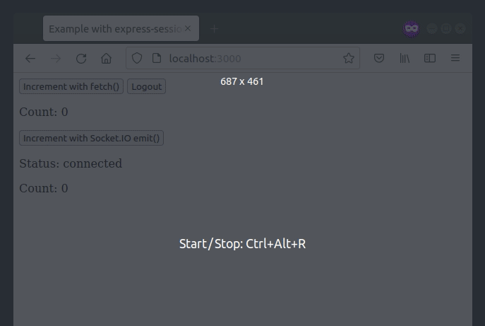

# Example with [express-session](https://www.npmjs.com/package/express-session)

This example shows how to share a session context between [Express](http://expressjs.com/) and [Socket.IO](https://socket.io/docs/v4/):



Please read the related guide: https://socket.io/how-to/use-with-express-session

## How to use

```
$ npm install
$ npm start
```

And point your browser to `http://localhost:3000`. Optionally, specify a port by supplying the `PORT` env variable.
