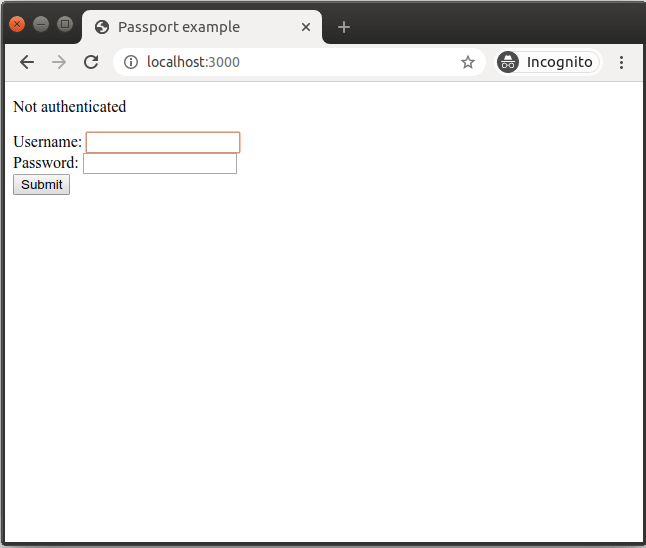

# Example with [Passport](http://www.passportjs.org/)

This example shows how to retrieve the authentication context from a basic [Express](http://expressjs.com/) + [Passport](http://www.passportjs.org/) application.



## How to use

```
$ npm ci && npm start
```

And point your browser to `http://localhost:3000`. Optionally, specify a port by supplying the `PORT` env variable.
