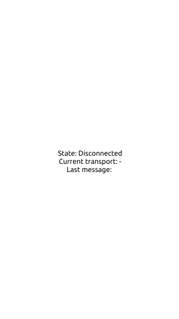
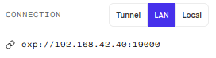

# Example with [React Native](https://reactnative.dev/)


This example shows a basic example based on [Expo](https://expo.io/). 



## How to use

```
$ npm ci
$ npm start # run expo
$ node server.js # run the server
```

You will probably need to update the IP address of your server in the `App.js` file:


