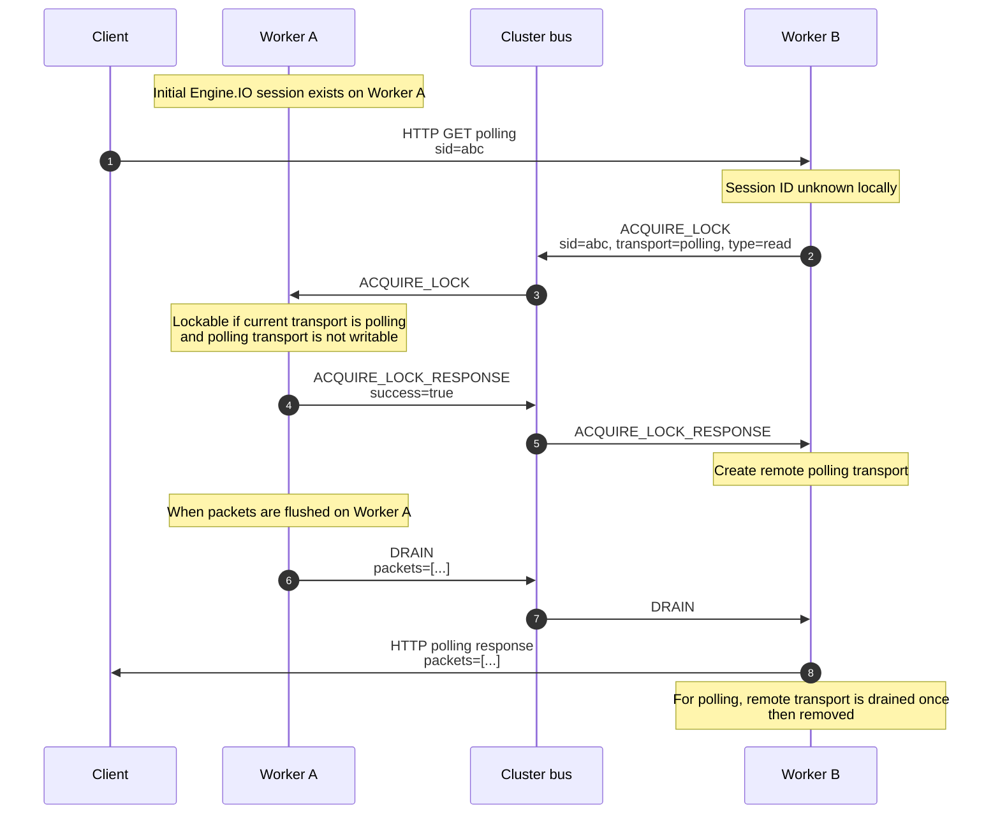
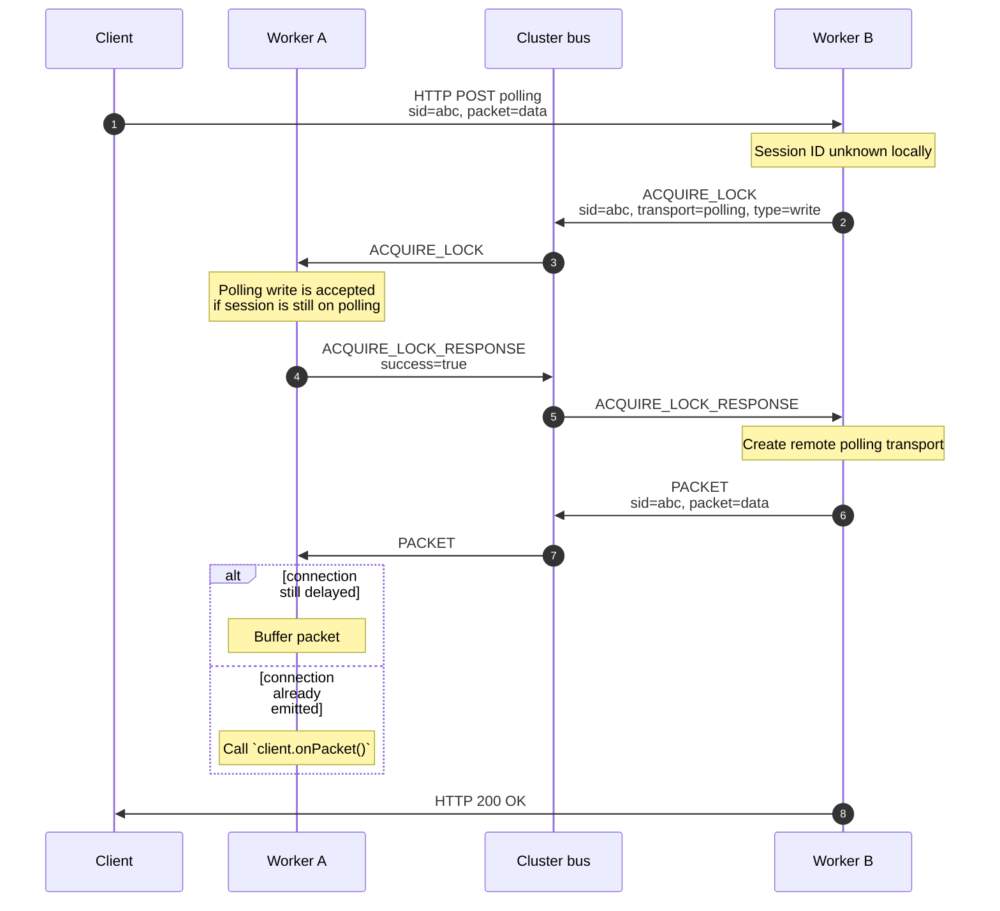
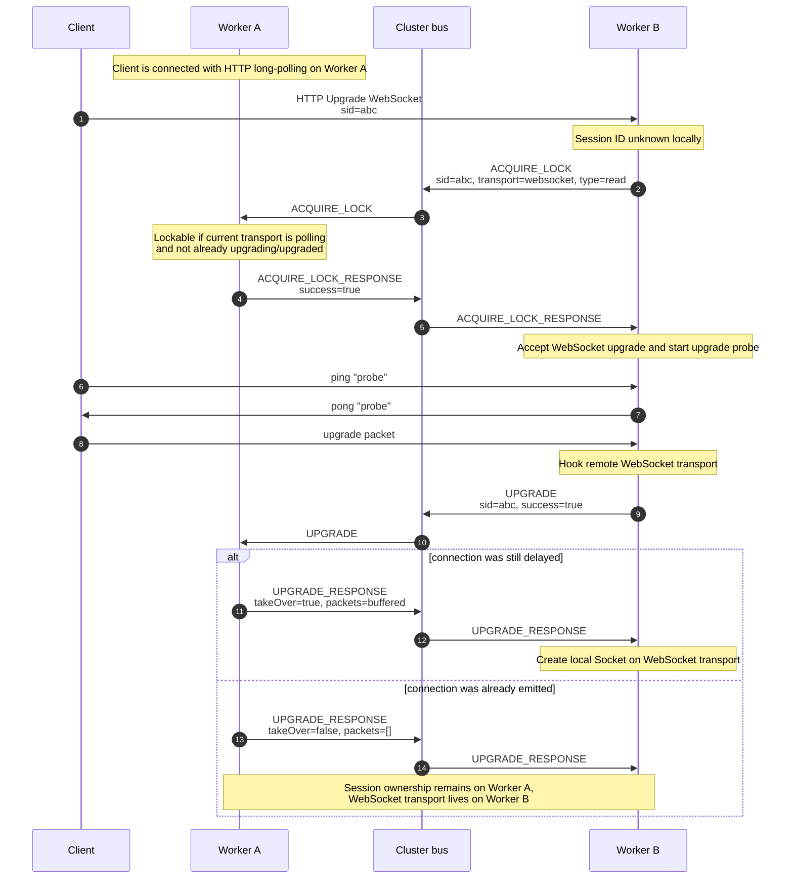

<h1>Sequence diagrams</h1>

<!-- TOC -->
  * [Scenarios](#scenarios)
    * [HTTP long-polling (read)](#http-long-polling-read)
    * [HTTP long-polling (write)](#http-long-polling-write)
    * [WebSocket upgrade](#websocket-upgrade)
  * [Message types](#message-types)
<!-- TOC -->

## Scenarios

### HTTP long-polling (read)

### HTTP long-polling (write)

### WebSocket upgrade

## Message types

| Message type            | Direction                               | Purpose                                                                                                   |
|-------------------------|-----------------------------------------|-----------------------------------------------------------------------------------------------------------|
| `ACQUIRE_LOCK`          | Requesting worker → cluster             | Ask which worker owns the session ID and whether the requested transport operation is allowed.            |
| `ACQUIRE_LOCK_RESPONSE` | Owning worker → requesting worker       | Grant or deny the lock request.                                                                           |
| `DRAIN`                 | Owning worker → remote transport worker | Forward packets that need to be written back to the client.                                               |
| `PACKET`                | Remote transport worker → owning worker | Forward a packet received from the client to the worker that owns the session.                            |
| `UPGRADE`               | Upgrade worker → owning worker          | Notify the owning worker that the transport upgrade probe succeeded.                                      |
| `UPGRADE_RESPONSE`      | Owning worker → upgrade worker          | Tell the upgrade worker whether it should take over the session, and optionally include buffered packets. |
| `CLOSE`                 | Remote transport worker → owning worker | Notify the owning worker that the remote transport closed or errored.                                     |
